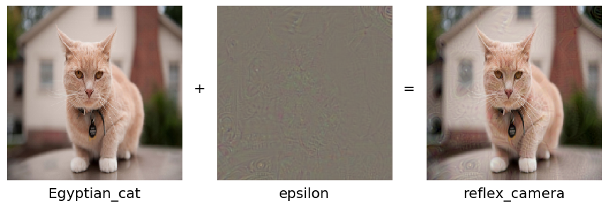

# Deep-learning-practical-work
Compilation of some practical work around deep learning thematic

___

## Learning section: pratical examples with Keras framework
From the book *Deep learning with Python* from François Chollet
* [Classifying movie reviews](https://github.com/To-jak/Deep-learning-practical-work/blob/master/learning/Classifying_movie_reviews.ipynb) - binary classification example
* [Classifying newswires](https://github.com/To-jak/Deep-learning-practical-work/blob/master/learning/Classifying_newswires.ipynb) - multiclass classification example
* [Predicting house prices](https://github.com/To-jak/Deep-learning-practical-work/blob/master/learning/Predicting_house_prices.ipynb) - regression example
* [Quick convnet model for MNIST dataset classification](https://github.com/To-jak/Deep-learning-practical-work/blob/master/learning/Keras_convnet_quick_model.ipynb)
* [Cats and dogs](https://github.com/To-jak/Deep-learning-practical-work/blob/master/learning/training_CNN_from_scratch_on_a_small_dataset.ipynb) - from scratch CNN classification example on a small dataset
___

## Multilayer perceptron
MLP implementations. *Work done in Geoffroy Peeters's deep learning course at Telecom Paris.*
### [Multi-Layer Perceptron for classification only using numpy](https://github.com/To-jak/Deep-learning-practical-work/blob/master/MLP_python.ipynb)  
Full implementation of a two layers Multi-Layer Perceptron (MLP) with 1 hidden layer in Python, for a classification problem.
* Forward propagation
* Computation of the cost/loss
* Backward propagation
* Parameters udpate

### [Different implementations for MLP binary classification with pytorch](https://github.com/To-jak/Deep-learning-practical-work/blob/master/MLP_pytorch.ipynb)
Three different implementations:
* **Model 1**: manually defining the parameters `W1,b1,W2,b2,W3,b3`, writing the forward equations, writting the loss equation, calling the `.backward()` and manually updating the weights using `W1.grad`.
* **Model 2**: using the `Sequential` class of pytorch
* **Model 3**: a custom `torch.nn.Module` class.

## Recurrent neural network
### [Music sequences generation](https://github.com/To-jak/Deep-learning-practical-work/blob/master/Generating_music_sequences.ipynb)
Training a RNN language model with LSTM layers to generate cello suite sequences. *Work done in Geoffroy Peeters's deep learning course at Telecom Paris.*

## Convolutional neural network
*Work inspired after Alasdair Newson's deep learning course at Telecom Paris.*
### [Deep dream algorithm implementation](https://github.com/To-jak/Deep-learning-practical-work/blob/master/deep_dream_algorithm_example.ipynb)
Implementation of the weird "deep dream" algorithm, a fun way to vizualize what convolutional networks are learning.

### [Adversarial example for CNN](https://github.com/To-jak/Deep-learning-practical-work/blob/master/adversarial_example_for_cnn.ipynb)
Implementation of a quick adversarial case for a convolutional network, to fool it and force misclassification using gradient maximisation.

